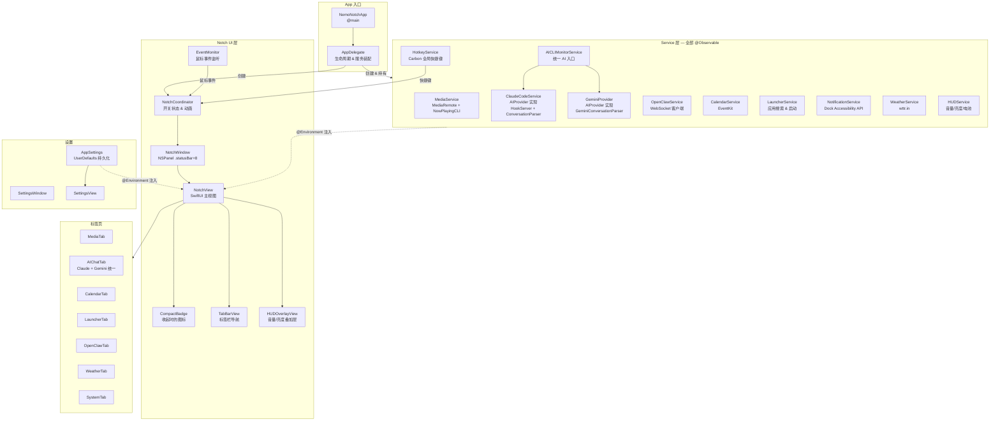
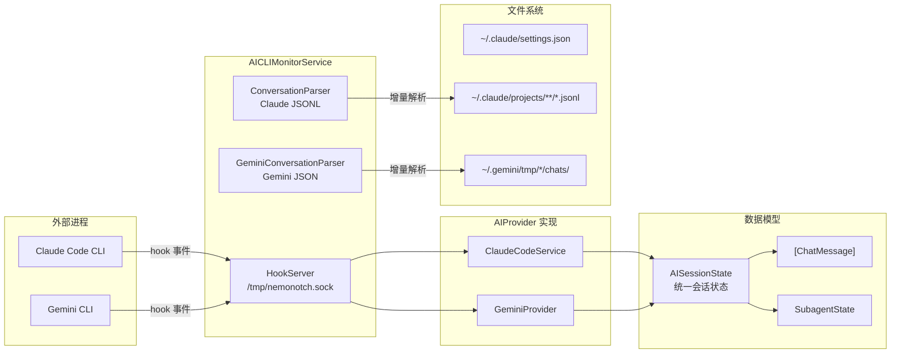
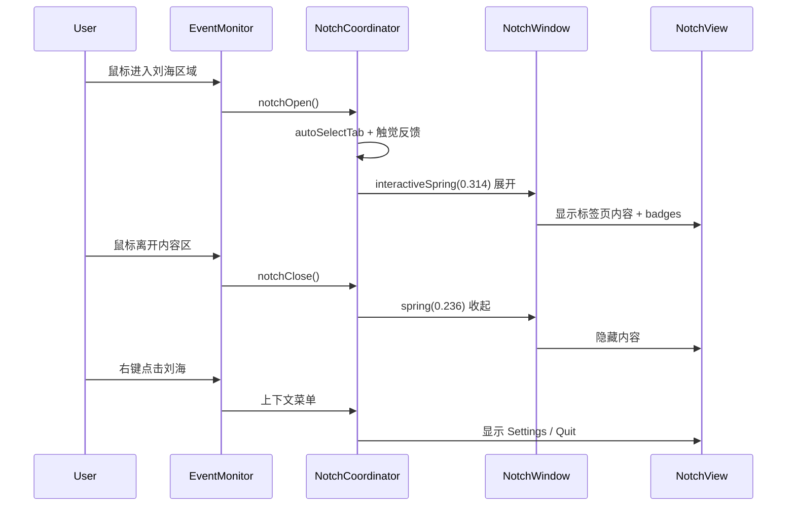

# NemoNotch — CLAUDE.md

## 项目简介

NemoNotch 是一个 macOS 刘海工具，在 MacBook 刘海区域提供可交互的浮动面板，集成媒体控制、日历事件、AI CLI 监控（Claude Code / Gemini CLI）、OpenClaw 多代理监控和应用启动器。

## 技术栈

- Swift 6 + SwiftUI，仅 macOS，依赖 CocoaLumberjack
- 关键框架：AppKit（NSWindow）、MediaPlayer、EventKit、IOKit

## 项目结构

```
NemoNotch/
├── NemoNotchApp.swift           # 入口，MenuBarExtra，全局快捷键，服务装配
├── Models/                      # 数据模型（Tab, AppSettings, AIProvider, PlaybackState 等）
├── Notch/                       # 刘海 UI 核心（窗口、动画、事件监听、TabBar、HUD）
├── Tabs/                        # 各标签页内容视图（AIChatTab 统一 AI 会话）
├── Services/                    # 后台服务（媒体、日历、AI CLI、启动器等）
├── Settings/                    # 设置界面
└── Helpers/                     # 工具类（MarkdownRenderer, ClaudeCrabIcon, ToolStyles）
```

## 架构总览



### AI 服务架构（多提供商）



### Notch 事件流



### Badge 优先级（刘海收起时）

```
notification > openclaw active > ai approval > ai working > media playing > calendar upcoming
```

### 技术架构

**Service 层（数据源）**

- 11 个服务（含 AICLIMonitorService），各自独立获取数据
- `AICLIMonitorService` 作为统一 AI 入口，协调 `ClaudeCodeService` 和 `GeminiProvider`（均实现 `AIProvider` 协议）
- 全部由 `AppDelegate` 在 `applicationDidFinishLaunching` 中创建，通过 `.environment()` 注入到 SwiftUI 视图树
- 没有 Combine 或单例（除 LogService/EventMonitor），用闭包回调串联事件

**AI 多提供商架构**

- `AIProvider` 协议定义统一接口：sessions、activeSession、handleEvent、installHooks、respondToPermission
- `ClaudeCodeService` 实现 AIProvider，通过 Unix Socket 接收 hook 事件，ConversationParser 增量解析 JSONL
- `GeminiProvider` 实现 AIProvider，同样接收 hook 事件，GeminiConversationParser 解析 Gemini 会话文件
- `AICLIMonitorService` 持有 HookServer，将事件路由到对应 provider，提供 `activeSession` 供 UI 层消费
- `AISessionState` 统一存储会话状态（phase、tokens、messages、subagent 等），支持 `AISource` 区分来源

**Notch UI 层（窗口 + 交互）**

- `NotchWindow`（NSPanel 子类）浮在 `.statusBar + 8` 层级，`PassThroughView` 控制点击穿透
- `EventMonitor`（单例）监听全局鼠标事件 → `NotchCoordinator` 管理开/关状态和 spring 动画
- `TabBarView` 提供水平标签栏导航，`HUDOverlayView` 显示音量/亮度/电池分段条
- 收起时 `CompactBadge` 在刘海两侧显示状态图标，按优先级显示（notification > ai > media > calendar）

**Tab 层（内容展示）**

- 7 个 Tab（media/calendar/claude/openclaw/launcher/weather/system），每个对应一个 Service
- `system` tab 展示 Top 5 进程资源排行（CPU + 内存），使用 `libproc` 内核 API 获取进程数据，`NSRunningApplication` 补充图标和名称
- `claude` tab 映射到 `AIChatTab`，统一展示 Claude 和 Gemini 会话列表、对话详情、权限审批
- `ChatMessageView` 渲染各类型消息（用户/助手/工具/系统），`MarkdownRenderer` 提供轻量 Markdown 解析
- `NotchView` 根据 `Tab.sorted()` 渲染启用的标签页，支持滑动手势切换
- 自动选择逻辑：AI 工作中 → AIChatTab，OpenClaw 有活跃代理 → OpenClawTab，媒体播放中 → MediaTab

**核心数据流**：Service → @Observable 属性变化 → SwiftUI 自动重绘 → Tab 内容更新。用户交互（点击、手势）通过 EventMonitor → NotchCoordinator → 动画更新视图状态。

### 代码借鉴来源

| 模块 | 借鉴项目 | 具体借鉴内容 |
|------|---------|-------------|
| NotchWindow + PassThroughView | **Peninsula** | NSPanel 子类窗口管理、刘海定位、三态状态机（closed/popping/opened） |
| NotchCoordinator 动画 | **NotchDrop** | 三态动画系统、Combine 鼠标接近检测 |
| Spring 动画参数 | **DynamicNotchKit** | `.bouncy(duration: 0.4)` 弹簧动画、自动消失 Timer |
| NSScreen 扩展 | **DynamicNotchKit** | `hasNotch`、`notchSize`、`notchFrame` 检测（提取自其 `NSScreen+Extensions.swift`） |
| NotchBackgroundView 刘海形状 | **Peninsula** | 匹配物理刘海轮廓的自定义 Shape 渲染 |
| EventMonitor 鼠标事件 | **NotchDrop** | 全局 NSEvent monitor 鼠标接近/离开检测 |
| HotkeyService | **Peninsula** | Carbon `RegisterEventHotKey` 全局快捷键注册 |
| MediaRemote 桥接 | **PlayStatus** | `dlopen`/`dlsym` 动态加载 MediaRemote.framework 私有 API |
| NowPlayingCLI 回退策略 | **nowplaying-cli** | daemon 连接 → legacy callback → MRNowPlayingController 三级回退，dylib 路径搜索 |
| AI Hook 架构 | **masko-code** | Unix Socket 事件传递、HookInstaller 写入 `~/.claude/settings.json`、`hook-sender.sh` 进程树检测 |
| ConversationParser | **vibe-notch** | 增量 JSONL 解析、ChatMessage 结构化解析（参考其 parser 709-960 行） |
| AI 权限审批 UI | **vibe-notch** | PermissionRequest 审批流程、Socket JSON 响应 |
| HUDService 亮度监测 | **MonitorControl** | `DisplayServicesGetBrightness()` 私有 API，`dlopen` 动态加载 |
| SystemService 系统监控 | **eul** | `host_processor_info` CPU 采样、`host_statistics64` 内存读取、IOKit 电池信息 |
| CompactBadge 状态图标 | **NotchNook** | 刘海两侧图标布局风格 |

所有参考项目位于 `/Users/gaozimeng/Learn/macOS/`，遇到实现问题时优先查看这些项目的做法。

## 参考项目指南

所有参考项目位于 `/Users/gaozimeng/Learn/macOS/`，遇到实现问题时优先查看这些项目的做法。

### 刘海窗口与交互

| 需求 | 参考项目 | 要点 |
|------|---------|------|
| 刘海窗口定位、多屏幕支持 | **NotchDrop** | `NotchWindow` 子类，`screen.notchSize` 检测，每屏独立 WindowController |
| 刘海动画、自动收起、内容切换 | **DynamicNotchKit** | Spring 动画 `.bouncy(duration: 0.4)`，Timer 自动消失，鼠标悬停延迟关闭 |
| 多视图状态机、Cmd-Tab 替代 | **Peninsula** | 复杂状态管理，Accessibility API 获取窗口/应用信息 |

### 媒体与播放控制

| 需求 | 参考项目 | 要点 |
|------|---------|------|
| Now Playing 信息获取 | **PlayStatus** / **Tuneful** | MediaPlayer 框架，MPNowPlayingInfoCenter 轮询 |
| 媒体键拦截 | **PlayStatus** | `sendEvent` override 拦截 `NX_KEYTYPE_PLAY` 等系统按键 |
| 命令行获取播放信息 | **nowplaying-cli** | 纯 CLI 方案，可参考其输出格式 |

### 窗口管理与快捷键

| 需求 | 参考项目 | 要点 |
|------|---------|------|
| 全局快捷键、窗口操作 | **Loop** | `WindowEngine` 架构，径向菜单，键盘事件处理 |
| Spotlight 风格搜索栏 | **DSFQuickActionBar** | NSPanel 浮窗，异步搜索，键盘导航（方向键/Enter/ESC） |
| Dock 悬停预览 | **DockDoor** | SCWindow 截图，窗口缩略图缓存，AXUIElement 控制窗口 |

### 菜单栏与系统工具

| 需求 | 参考项目 | 要点 |
|------|---------|------|
| 菜单栏架构、组件化 | **eul** | StatusBarManager，Combine 响应式，深色/浅色模式适配 |
| 菜单栏 B 站播放器 | **Bili.Mac.MenuBar** | 菜单栏内嵌复杂 UI |
| 菜单栏番茄钟 | **TomatoBar** | 轻量菜单栏应用模板 |
| 系统负载动画 | **menubar_runcat** | 动画帧驱动，反映系统状态 |

### 启动器与搜索

| 需求 | 参考项目 | 要点 |
|------|---------|------|
| 应用启动器 | **sol** / **Verve** | sol（原生 Swift）、Verve（Rust+Tauri）启动器架构 |
| 文件搜索、剪贴板 | **Snap** | Spotlight 替代方案，搜索与索引实现 |

### 通用参考

| 需求 | 参考项目 | 要点 |
|------|---------|------|
| SwiftUI + SwiftData | **NotesApp** | 现代 SwiftUI 数据持久化模式 |
| 代码片段管理 | **Snippets** | 数据管理 + 搜索 UI |
| 自定义 UI 组件 | **Luminare** / **CustomWindowStyle** | SwiftUI 组件库，窗口样式定制 |
| 全局语音输入 | **QuickSpeech** | 全局快捷键 + 系统集成 |
| 屏幕录制 | **Recorder** | ScreenCaptureKit 用法 |

## 日志系统

- 使用 CocoaLumberjack（`LogService`），同时输出到控制台和文件
- 日志文件目录：`~/.NemoNotch/logs/`，保留 7 天，每天轮转
- 调用方式：`LogService.debug/info/warn/error("message", category: "xxx")`

## 打包发布

- 一键打包命令：`./build.sh`，自动完成 Archive → 导出 .app → 生成 DMG
- 输出文件：`build/NemoNotch.dmg`
- 配套文件：`ExportOptions.plist`（导出配置）、`build.sh`（打包脚本）
- 当前跳过签名（`CODE_SIGN_IDENTITY="-"`），如需正式分发需配置签名和公证

### 发版流程

用户说"发版"时，执行以下步骤：

1. 确认所有更改已提交到 main 分支
2. 创建版本 tag（格式 `vX.Y.Z`，如 `v0.1.0`）
3. 推送 tag 到 origin：`git push origin <tag>`
4. GitHub Actions 自动构建并发布 DMG 到 Releases（workflow 文件：`.github/workflows/release.yml`）
5. 查看构建状态：`https://github.com/GaoZimeng0425/NemoNotch/actions`

## Git Flow 开发规范

**绝对禁止直接在 main 分支上提交代码。** 所有开发必须通过 Git Flow 流程进行，违反此规则会破坏发布分支的稳定性。

### 分支说明

- **main**: 稳定发布分支，只接受来自 develop 的合并，绝不直接 commit
- **develop**: 日常开发分支，所有功能分支基于此创建
- **feature/xxx**: 功能分支，从 develop 拉出，完成后合并回 develop
- **hotfix/xxx**: 紧急修复分支，从 main 拉出，修复后合并回 main 和 develop

### 工作流程

1. 新功能开发：`git checkout develop && git checkout -b feature/xxx`
2. 开发完成后合并回 develop，测试通过后合并 develop 到 main
3. 发版时从 main 打 tag（`vX.Y.Z`）

## 开发约定

- 设计文档放在 `docs/plans/` 目录，已实现的 plan 自动归档，提交时一并提交 plan 文档
- 每次新增功能或修改已有功能后，必须同步更新 `README.md` 和 `README_CN.md` 中对应的功能描述、技术栈等章节
- 所有 Service 使用 `@Observable` 宏，通过 SwiftUI 响应式更新 UI
- AI 提供商实现 `AIProvider` 协议，通过 `AICLIMonitorService` 统一管理
- 刘海窗口 level 固定为 `.statusBar + 8`，属性为 `fullScreenAuxiliary` + `stationary` + `canJoinAllSpaces`
- 优先查阅参考项目中的现成实现，避免从零造轮子

### 协议优先的可扩展设计

多提供商场景（AI Provider、Conversation Parser 等）采用**协议 + 具体实现**模式：

- 定义协议只包含**通用接口**（如 `messages`、`tokens`、`findSessionFile`）
- 每个 Provider/Parser 保留**独立的 Result 类型和解析逻辑**，不强行统一数据结构
- Provider 特有字段（Claude 的 `cacheRead`、Gemini 的 `thoughtTokens`）留在各自实现中，通过协议扩展或具体类型访问
- 通用消费方走协议接口，特定逻辑直接访问具体类型
- 新增 Provider（如 DeepSeek、OpenAI）只需实现协议，不改动已有代码
