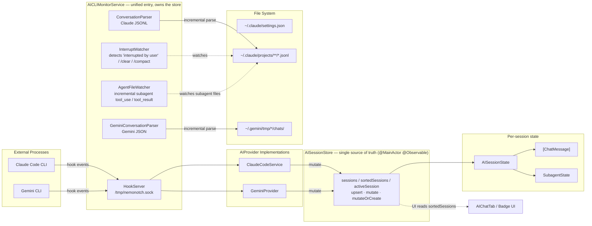
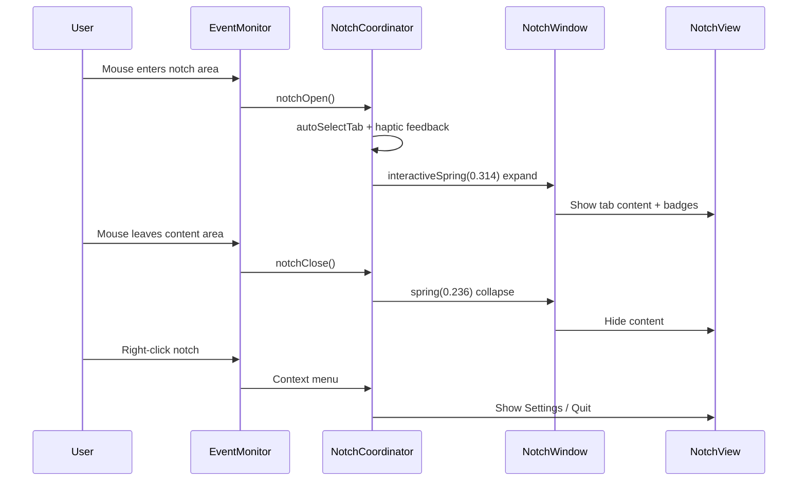

# NemoNotch — CLAUDE.md

## Project Overview

NemoNotch is a macOS notch utility that provides an interactive floating panel in the MacBook notch area, integrating media controls, calendar events, AI CLI monitoring (Claude Code / Gemini CLI), multi-agent monitoring (OpenClaw / Hermes-agent), and an app launcher.

### Tech Stack

- Swift 6 + SwiftUI, macOS only, depends on CocoaLumberjack, KeyboardShortcuts
- Key frameworks: AppKit (NSWindow), MediaPlayer, ScriptingBridge, EventKit, IOKit

### Project Structure

```
NemoNotch/
├── NemoNotchApp.swift           # Entry point, MenuBarExtra, global hotkeys, service assembly
├── Models/                      # Data models (Tab, AppSettings, AIProvider, PlaybackState, MultiAgentMonitor, etc.)
├── Notch/                       # Notch UI core (window, animation, event monitoring, TabBar, HUD)
├── Tabs/                        # Tab content views (AIChatTab unifies AI sessions, AgentMonitorTab unifies agents)
├── Services/                    # Background services (media, calendar, AI CLI, launcher, HermesService, etc.)
├── Settings/                    # Settings UI
└── Helpers/                     # Utilities (MarkdownRenderer, ClaudeCrabIcon, ToolStyles)
```

## Architecture

### Overview


```mermaid
graph TB
    subgraph Entry["App Entry"]
        App["NemoNotchApp<br/>@main"]
        AD["AppDelegate<br/>Lifecycle & Service Assembly"]
    end

    subgraph Services["Service Layer — all @Observable"]
        MS["MediaService<br/>MediaRemote + NowPlayingCLI + MediaBridge"]
        APM["MediaAutomationPermissionMonitor<br/>Per-bundle AppleEvents auth probe"]
        AIM["AICLIMonitorService<br/>Unified AI entry + owns AISessionStore"]
        AISS["AISessionStore<br/>Central AI session truth source (@Observable)"]
        CCS["ClaudeCodeService<br/>AIProvider impl<br/>HookServer + ConversationParser"]
        GP["GeminiProvider<br/>AIProvider impl<br/>GeminiConversationParser"]
        REG["AgentMonitorRegistry<br/>Unifies agent monitors"]
        OCS["OpenClawService<br/>WebSocket client (MultiAgentMonitor)"]
        HES["HermesService<br/>HTTP API client (MultiAgentMonitor)"]
        CS["CalendarService<br/>EventKit"]
        LS["LauncherService<br/>App search & launch"]
        NS["NotificationService<br/>Dock Accessibility API"]
        WS["WeatherService<br/>wttr.in"]
        UQS["UsageQuotaService<br/>Claude + Codex usage quota"]
        HUD["HUDService<br/>Volume/Brightness/Battery"]
        SYS["SystemService<br/>CPU/memory/disk sampling (SystemTab)"]
        TS["TaskStore<br/>Persistent TODO list (~/.NemoNotch/tasks.json)"]
        PHS["PomodoroHistoryStore<br/>Append-only history (~/.NemoNotch/pomodoro-history.json)"]
        PTS["PomodoroTimerService<br/>State machine + tick + end-alert pipeline"]
        NPM["NotificationPermissionMonitor<br/>UNUserNotificationCenter probe"]
        HK["Hotkeys.swift<br/>KeyboardShortcuts registration (AppDelegate.setupHotkeys)"]
    end

    subgraph NotchUI["Notch UI Layer"]
        NC["NotchCoordinator<br/>Open/close state & animation"]
        NW["NotchWindow<br/>NSPanel .statusBar+8"]
        NV["NotchView<br/>SwiftUI main view"]
        EM["EventMonitor<br/>Mouse event listener"]
        CB["CompactBadge<br/>Collapsed icons"]
        TB["TabBarView<br/>Tab navigation"]
        HO["HUDOverlayView<br/>Volume/Brightness overlay"]
    end

    subgraph Tabs["Tabs"]
        OT["OverviewTab<br/>Media + Calendar + Weather"]
        AT["AIChatTab<br/>Claude + Gemini unified"]
        LT["LauncherTab"]
        OCT["AgentMonitorTab<br/>OpenClaw + Hermes unified"]
        PT["PomodoroTab<br/>Idle stats + TODO list + active pie"]
        ST["SystemTab"]
    end

    subgraph Settings["Settings"]
        AS["AppSettings<br/>UserDefaults persistence"]
        SW["SettingsWindow"]
        SV["SettingsView"]
    end

    App --> AD
    AD -->|"creates & owns"| Services
    AD -->|"creates"| NC
    AIM --> CCS
    AIM --> GP
    AIM -->|"owns"| AISS
    CCS -.->|"mutate"| AISS
    GP -.->|"mutate"| AISS
    REG -->|"registers"| OCS
    REG -->|"registers"| HES
    MS -.->|"denied / authorized events"| APM
    NC --> NW --> NV
    NV --> Tabs
    NV --> CB
    NV --> TB
    NV --> HO
    EM -->|"mouse events"| NC
    HK -->|"hotkeys"| NC
    AS --> SV

    Services -.->|"@Environment injection"| NV
    AS -.->|"@Environment injection"| NV
```

Core data flow: Service → @Observable property changes → SwiftUI auto-redraw → Tab content updates.

### AI Service Architecture


```mermaid
graph LR
    subgraph External["External Processes"]
        CC["Claude Code CLI"]
        GC["Gemini CLI"]
    end

    subgraph Monitor["AICLIMonitorService — unified entry, owns the store"]
        HS["HookServer<br/>/tmp/nemonotch.sock"]
        CP["ConversationParser<br/>Claude JSONL"]
        GCP["GeminiConversationParser<br/>Gemini JSON"]
        IW["InterruptWatcher<br/>detects 'interrupted by user' / /clear / /compact"]
        AFW["AgentFileWatcher<br/>incremental subagent tool_use / tool_result"]
    end

    subgraph Providers["AIProvider Implementations"]
        CLS["ClaudeCodeService"]
        GPR["GeminiProvider"]
    end

    subgraph Store["AISessionStore — single source of truth (@MainActor @Observable)"]
        ST["sessions / sortedSessions / activeSession<br/>upsert · mutate · mutateOrCreate"]
    end

    subgraph Data["Per-session state"]
        AIS["AISessionState"]
        MSG["[ChatMessage]"]
        SA["SubagentState"]
    end

    subgraph Files["File System"]
        S["~/.claude/settings.json"]
        CJ["~/.claude/projects/**/*.jsonl"]
        GJ["~/.gemini/tmp/*/chats/"]
    end

    UI["AIChatTab / Badge UI"]

    CC -->|"hook events"| HS
    GC -->|"hook events"| HS
    HS --> CLS
    HS --> GPR
    CP -->|"incremental parse"| CJ
    GCP -->|"incremental parse"| GJ
    IW -.->|"watches"| CJ
    AFW -.->|"watches subagent files"| CJ
    CLS -->|"mutate"| ST
    GPR -->|"mutate"| ST
    ST --> AIS
    AIS --> MSG
    AIS --> SA
    ST -.->|"UI reads sortedSessions"| UI
```

**AISessionStore — central session truth source:** All AI providers (Claude Code, Gemini, future DeepSeek/OpenAI) write into one `@MainActor @Observable` store (`NemoNotch/Services/AISessionStore.swift`) owned by `AICLIMonitorService`. Providers translate hook events + file-parse results into `upsert` / `mutate` / `mutateOrCreate` calls on the store; **UI reads `sortedSessions` directly and never touches a provider's internal state**. The store keeps a cached `sortedSessions` (descending by `lastEventTime`, rebuilt on every mutation) and exposes `activeSession` via a priority comparator (`waitingForApproval > processing/compacting > waitingForInput > idle > ended`, ties broken by recency). `sessions(for:)` filters by `AISource` for per-provider surfaces (e.g. a badge that only cares about Claude). Adding a provider means writing to this store — no UI or consumer changes.

**Agent monitoring — registry pattern:** `OpenClawService` and `HermesService` both conform to `MultiAgentMonitor` and are collected by `AgentMonitorRegistry` (`NemoNotch/Services/AgentMonitorRegistry.swift`). The registry exposes unified reads — `installedMonitors`, `anyActiveAgent`, `hasAnyActiveAgent`, `activeAgents` (non-idle across all monitors, sorted by recency) — which `AgentMonitorTab` and the badge layer consume. Hermes additionally has its own `HermesConversationParser` + `HermesHookInstaller`, mirroring Claude's parser/installer split. Adding an agent monitor is one `registry.register(...)` call.

**Usage quota:** `UsageQuotaService` exposes `quotas: [QuotaProvider: ProviderUsageQuota]` and fetches **Claude Code** (Keychain `Claude Code-credentials` / `~/.claude/.credentials.json` → `GET /api/oauth/usage`) and **Codex** (`~/.codex/auth.json` / Keychain `Codex Auth` → `GET chatgpt.com/backend-api/wham/usage` with `ChatGPT-Account-Id`) concurrently. The Codex section appears only when a Codex credential is detected (`hasCodexCredential`). Windows are normalized (session→weekly) and rendered as a card in `AIChatTab`. **Credential reads are file-first** (`~/.claude/.credentials.json` / `~/.codex/auth.json`). When a credential lives only in the Keychain, the AI tab must never auto-prompt: the no-UI flags do **not** suppress the cross-app ACL dialog for a GUI app's `kSecReturnData` read (only attribute reads are silent). So the automatic path uses an **attributes-only probe** (`kSecReturnAttributes`) to detect presence without prompting → `CredentialStatus.needsAuthorization` renders an **Authorize** button (+ a one-line reason) in both the full card and the compact meters, matching the `PermissionCard` "never auto-prompt" pattern. `authorize(_:)` does the one interactive `kSecReturnData` read (off the main actor) that surfaces the dialog and **persists the grant keyed by the running code's cdhash** (`quota.keychainGrantedIdentity.<provider>` in UserDefaults, via `SecCodeCopySigningInformation`); a later launch does a silent gated data read **only if the cdhash still matches**. Because ad-hoc signing changes the cdhash each rebuild, a stale grant reads as not-granted → the entry path shows the button (no auto-prompt) instead of a prompting data read; a stable signature makes it truly one-time. See macOS cookbook §14.3. `LifecycleAware`, 60s refresh throttle, 5-minute timer, robust `resets_at` parse, and reset-backfill from the previous fetch (ideas borrowed from `CodexBar`). Gemini quota is a planned follow-up (needs OAuth token refresh + project resolution).

### Notch Event Flow


```mermaid
sequenceDiagram
    participant User
    participant EM as EventMonitor
    participant NC as NotchCoordinator
    participant NW as NotchWindow
    participant NV as NotchView

    User->>EM: Mouse enters notch area
    EM->>NC: notchOpen()
    NC->>NC: autoSelectTab + haptic feedback
    NC->>NW: interactiveSpring(0.314) expand
    NW->>NV: Show tab content + badges

    User->>EM: Mouse leaves content area
    EM->>NC: notchClose()
    NC->>NW: spring(0.236) collapse
    NW->>NV: Hide content

    User->>EM: Right-click notch
    EM->>NC: Context menu
    NC->>NV: Show Settings / Quit
```

**Hotkey-aware dismiss:** When the notch is opened via global hotkey, it does NOT close on mouse-move-outside until either (a) the mouse enters the content area at least once, (b) 3 seconds elapse with no mouse entry (`NotchConstants.hotkeyAutoCloseDelay`), or (c) the user presses ESC / hotkey / clicks outside. Mouse-hover open path is unchanged. State machine lives in `HotkeyDismissState`.

**Permission UI pattern:** Calendar, Location, Automation, and Notification permissions are NOT auto-requested on launch. Instead the relevant Tab/Settings section renders a `PermissionCard` with a "Grant" button. AX uses the same card but only links to System Settings (no programmatic request API). Card lives at `NemoNotch/Helpers/PermissionCard.swift`. Notification permission ships in the Pomodoro settings page (`PomodoroSettingsView`), backed by `NotificationPermissionMonitor`.

**Pomodoro hotkeys:** `openPomodoro` opens the Pomodoro tab; `openQuickStart` toggles the centered draggable `QuickStartWindow` (`NemoNotch/Notch/QuickStartWindow.swift` / `QuickStartWindowController.swift`). Neither has a default binding — users must set them in Settings → Pomodoro.

### Badge Priority (when notch is collapsed)

```
ai approval > notification > pomodoro running > agents active > ai working > media playing > calendar upcoming
```

### Activity Glow (when notch is expanded)

The expanded notch body renders a soft blurred glow ring hugging its inner edge whenever there is AI/agent activity — the center (content) stays clean. It is purely visual (`.allowsHitTesting` unaffected; never alters layout). Decision is the pure function `BadgeItem.glow(for: activeBadgeItems) -> NotchGlow`: `.attention` if any session awaits approval, else `.running` if AI is working or an agent is active, else `.none`. Both active states render in the app's theme accent (`NotchTheme.accent`, orange) — the enum stays split so the two can be re-differentiated later without touching the decision logic. `BadgeViewModel.glowState` exposes it; `NotchView` passes it to `NotchBackgroundView`, which strokes the notch's rounded shape, blurs it, and lets the existing notch `.mask` clip the outward spread so only an inner-edge ring remains; a further vertical `LinearGradient` `.mask` fades it so only the **lower-half** edge glows (vanishing by the middle). `.screen` blended, only when `status != .closed`. Tunables: `NotchConstants.glowRingOpacity` / `glowRingWidth` / `glowRingBlur` / `glowRingCoverage`.

## Debug Pitfalls

### Info.plist Configuration

**The project has `GENERATE_INFOPLIST_FILE = YES`**, so keys in the source `NemoNotch/Info.plist` will **not** end up in the build product! All Info.plist keys must be declared as `INFOPLIST_KEY_*` in `NemoNotch.xcodeproj/project.pbxproj` (both Debug and Release configurations).

Correct process for adding new permission descriptions (e.g. `NSAppleEventsUsageDescription`, `NSMicrophoneUsageDescription`):

1. Edit `project.pbxproj`, find all `INFOPLIST_KEY_NSCalendarsFullAccessUsageDescription = ...;` lines, add a new line next to them: `INFOPLIST_KEY_NSAppleEventsUsageDescription = "...";`
2. Verify: `/usr/libexec/PlistBuddy -c "Print :Key" $APP/Contents/Info.plist` must output the value
3. **Missing `NSAppleEventsUsageDescription` causes macOS to silently refuse to show the "automation authorization" dialog**, and the automation settings panel cannot manually add the app — this pitfall is extremely deep. When debugging, first check whether the build product's Info.plist actually has this key.

### Media Info Retrieval

**⚠️ Important**: Now Playing info (title, artist, album, artwork, duration, progress) is **retrieved via `NowPlayingCLI`**; playback state (isPlaying) uses a **reconcile mechanism** combining optimistic UI + ScriptingBridge authority.

- `NowPlayingCLI` launches a perl daemon (`mediaremote-mini.pl` + dylib extracted from `MediaRemoteMini.bin.gz`), polling via stdin/stdout JSON protocol
- `MediaService.updateNowPlaying()` → `nowPlayingCLI.fetchNowPlayingInfo()` → `applyInfo()`
- `MediaRemote.swift` is used for **sending control commands** (play/pause/next/prev/skip for unknown players) and **registering system notifications** to trigger refresh
- `MediaBridge` (ScriptingBridge) provides **authoritative play state** for known players (Music, Spotify) via `MediaBridge.isPlaying(bundleID:)` — synchronous, zero cache
- When debugging "info lost" issues, prioritize investigating NowPlayingCLI daemon state / dylib extraction (`~/Library/Application Support/NemoNotch/MediaRemoteMini.dylib`) / perl script, rather than modifying MediaRemote.swift

**Play/Pause state reconcile flow**:

1. User taps play/pause → `togglePlayPause()` sets optimistic `isPlaying` + `reconcileExpectedIsPlaying` guard
2. After 0.5s, `reconcilePlayState()` queries ScriptingBridge for real state
3. `applyInfo()` respects the guard: if CLI returns stale data, guard preserves the authoritative value; once CLI catches up (matches guard), guard self-clears

**Media seek (skip forward/back 15s)**:

- Music / Spotify: must use AppleScript `set player position` (`MediaBridge.setPlayerPosition`), because Spotify doesn't respond to MediaRemote's `SkipBackward/Forward` commands (system returns "never supported"). Requires user authorization in "System Settings → Privacy → Automation"
- Other players (browsers, Podcasts, etc.): use MediaRemote's `skip(interval:)` command

## Development Conventions

### Behavioral Guidelines

**Tradeoff:** These guidelines bias toward caution over speed. For trivial tasks, use judgment.

**Think Before Coding — Don't assume. Don't hide confusion. Surface tradeoffs.**
- State assumptions explicitly. If uncertain, ask.
- If multiple interpretations exist, present them — don't pick silently.
- If a simpler approach exists, say so. Push back when warranted.
- If something is unclear, stop. Name what's confusing. Ask.

**Simplicity First — Minimum code that solves the problem. Nothing speculative.**
- No features beyond what was asked.
- No abstractions for single-use code.
- No "flexibility" or "configurability" that wasn't requested.
- No error handling for impossible scenarios.
- If you write 200 lines and it could be 50, rewrite it.
- Ask yourself: "Would a senior engineer say this is overcomplicated?" If yes, simplify.

**Surgical Changes — Touch only what you must. Clean up only your own mess.**
- Don't "improve" adjacent code, comments, or formatting.
- Don't refactor things that aren't broken.
- Match existing style, even if you'd do it differently.
- If you notice unrelated dead code, mention it — don't delete it.
- Remove imports/variables/functions that YOUR changes made unused.
- Every changed line should trace directly to the user's request.

**Goal-Driven Execution — Define success criteria. Loop until verified.**
- Transform tasks into verifiable goals with success criteria.
- "Add validation" → "Write tests for invalid inputs, then make them pass"
- "Fix the bug" → "Write a test that reproduces it, then make it pass"
- "Refactor X" → "Ensure tests pass before and after"
- For multi-step tasks, state a brief plan with verification at each step.

Strong success criteria let you loop independently. Weak criteria ("make it work") require constant clarification.

**These guidelines are working if:** fewer unnecessary changes in diffs, fewer rewrites due to overcomplication, and clarifying questions come before implementation rather than after mistakes.

### Logging

Use CocoaLumberjack (`LogService`), outputting to both console and file. Log directory: `~/.NemoNotch/logs/`, rotated daily, retained for 7 days.

Usage: `LogService.debug/info/warn/error("message", category: "xxx")`

**Log coverage requirements** — When implementing features, logs must be added at every key point:

- **Service init/deinit**: `.info` level, marking lifecycle
- **External interactions**: Network requests, IPC, file I/O, subprocess launch/exit — `.info` (success) or `.error` (failure)
- **State changes**: Key property assignments (playback state, session phase, connection status) — `.debug` with before/after values
- **Error paths**: All `catch`, `nil` fallbacks, permission denials, timeouts — `.warn` or `.error` with context
- **Async callback entry**: Timer, NotificationCenter, Delegate callbacks — `.debug` to confirm callback fired

Category naming: use module name, e.g. `"MediaService"`, `"HookServer"`, `"NotchCoordinator"`, for easy filtering.

### Git Workflow

**Never commit directly on main.** All development must follow Git Flow.

- **main**: Stable release branch, only accepts merges from develop, never direct commits
- **develop**: Daily development branch, all feature branches are based on this
- **feature/xxx**: Feature branches, branched from develop, merged back to develop when complete
- **hotfix/xxx**: Hotfix branches, branched from main, merged back to both main and develop

Workflow:

1. New feature: `git checkout develop && git checkout -b feature/xxx`
2. After development, merge back to develop. After testing, merge develop to main
3. Release: tag from main (`vX.Y.Z`)

### Testing

- Unit tests live in `NemoNotchTests/`, written with **Swift Testing** (`import Testing`, `@Test`, `#expect`). Do not use XCTest for new code.
- Test pure logic — parsers, encoders, state transitions. Skip ScriptingBridge / AX / NSWindow integration tests (they need real macOS permissions and are flaky in CI).
- Run locally: `xcodebuild test -project NemoNotch.xcodeproj -scheme NemoNotch -destination 'platform=macOS'`.
- New tests must pass before merging to `develop`.

### Coding Conventions

- Design docs go in `docs/plans/`, implemented plans are auto-archived, commit plan docs alongside code
- After adding or modifying features, must update `README.md`, `README_CN.md`, and `CLAUDE.md` to reflect changes in feature descriptions, tech stack, architecture, etc.
- All Services use `@Observable` macro, UI updates via SwiftUI reactivity
- AI providers implement the `AIProvider` protocol, managed via `AICLIMonitorService`
- Notch window level is fixed at `.statusBar + 8`, properties: `fullScreenAuxiliary` + `stationary` + `canJoinAllSpaces`
- Prefer checking reference projects for existing implementations before building from scratch

### Protocol-First Extensible Design

Multi-provider scenarios (AI Provider, Conversation Parser, Multi-Agent Monitor, etc.) use a **protocol + concrete implementation** pattern:

- Define protocols with only **common interfaces** (e.g. `messages`, `tokens`, `findSessionFile`, `agents`, `hasActiveAgents`)
- Each Provider/Parser keeps **independent Result types and parsing logic**, don't force unified data structures
- Provider-specific fields (Claude's `cacheRead`, Gemini's `thoughtTokens`) stay in their implementations, accessed via protocol extensions or concrete types
- Generic consumers use protocol interfaces, specific logic accesses concrete types
- Adding a new Provider (e.g. DeepSeek, OpenAI) or a new Agent Monitor (e.g. HermesService) only requires implementing the protocol, no changes to existing code

## macOS Cookbook

A consolidated reference of every macOS-specific technique used in this codebase lives at `docs/macos-cookbook.md`. Organized by subsystem, anchored to `file:line` in real source. Use it before re-deriving how to do `dlopen`, MediaRemote, Carbon hotkeys, AX, IPC, etc.

**Top-level sections:** 1) How to use · 2) Critical pitfalls · 3) Build & release · 4) Private API loading · 5) Notch & window · 6) Event capture & hotkeys · 7) Media · 8) System sensing · 9) ScriptingBridge & AppleScript · 10) Accessibility & Dock badges · 11) Permissions · 12) IPC & subprocess · 13) Hook installers · 14) Keychain · 15) Swift 6 concurrency · 16) SwiftUI patterns · 17) Architecture · 18) Logging · 19) Reference projects index · 20) UI-test screenshot harness (`--uitest`).

**When to update:** Any commit that adds a new private API call, a new system-framework integration, or a new `@unchecked Sendable` / `nonisolated(unsafe)` boundary must add a matching technique entry in the same commit.

## Reference Projects

All reference projects are located at `/Users/gaozimeng/Learn/macOS/`. Check these first when facing implementation questions.

| Need | Reference Project | What to Reference |
|------|------------------|-------------------|
| Notch window positioning, multi-screen | **NotchDrop** | NSPanel subclass, screen.notchSize detection, per-screen WindowController |
| Notch window management, tri-state machine | **Peninsula** | NSPanel subclass, notch positioning, closed/popping/opened state machine, NotchBackgroundView notch shape rendering |
| Notch animation, auto-collapse | **DynamicNotchKit** | Spring animation .bouncy(duration: 0.4), Timer auto-dismiss, NSScreen extensions (hasNotch/notchSize/notchFrame) |
| Mouse event monitoring | **NotchDrop** | Global NSEvent monitor for mouse approach/leave detection |
| Global hotkeys | **KeyboardShortcuts** | User-customizable bindings via `Hotkeys.swift` name registry; registered in `AppDelegate.setupHotkeys` |
| Now Playing info retrieval | **PlayStatus** / **Tuneful** | MediaPlayer framework, MPNowPlayingInfoCenter polling |
| Media key interception | **PlayStatus** | sendEvent override intercepting NX_KEYTYPE_PLAY etc. |
| CLI now playing info | **nowplaying-cli** | daemon connection → legacy callback → MRNowPlayingController three-tier fallback, dylib path search |
| MediaRemote bridging | **PlayStatus** | dlopen/dlsym dynamic loading of MediaRemote.framework private API |
| Window management | **Loop** | WindowEngine architecture, radial menu, keyboard event handling |
| Spotlight-style search | **DSFQuickActionBar** | NSPanel floating window, async search, keyboard navigation |
| Dock hover preview | **DockDoor** | SCWindow screenshots, window thumbnail cache, AXUIElement window control |
| Menu bar architecture | **eul** | StatusBarManager, Combine reactive, dark/light mode adaptation, host_processor_info CPU sampling, host_statistics64 memory reading |
| Brightness monitoring | **MonitorControl** | DisplayServicesGetBrightness() private API, dlopen dynamic loading |
| AI Hook architecture | **masko-code** | Unix Socket event delivery, HookInstaller writing to ~/.claude/settings.json, hook-sender.sh process tree detection |
| Conversation parsing | **vibe-notch** | Incremental JSONL parsing, ChatMessage structured parsing, PermissionRequest approval flow |
| Status icons | **NotchNook** | Notch-side icon layout style |

## Build & Release

- One-click build: `./build.sh`, auto Archive → export .app → generate DMG
- Output: `build/NemoNotch.dmg`
- Supporting files: `ExportOptions.plist` (export config), `build.sh` (build script)
- Currently skips signing (`CODE_SIGN_IDENTITY="-"`), configure signing and notarization for official distribution

### Release Process

When the user says "release":

1. Confirm all changes are committed to main
2. Create version tag (format `vX.Y.Z`, e.g. `v0.1.0`)
3. Push tag to origin: `git push origin <tag>`
4. GitHub Actions auto-builds and publishes DMG to Releases (workflow: `.github/workflows/release.yml`)
5. Build status: `https://github.com/GaoZimeng0425/NemoNotch/actions`
