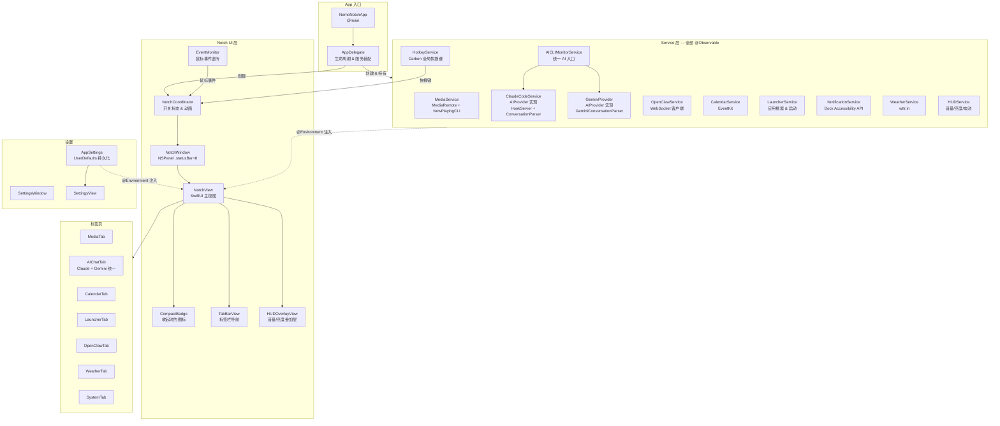
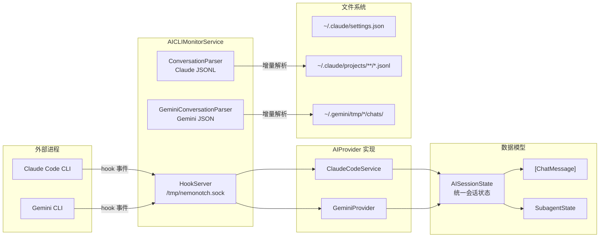
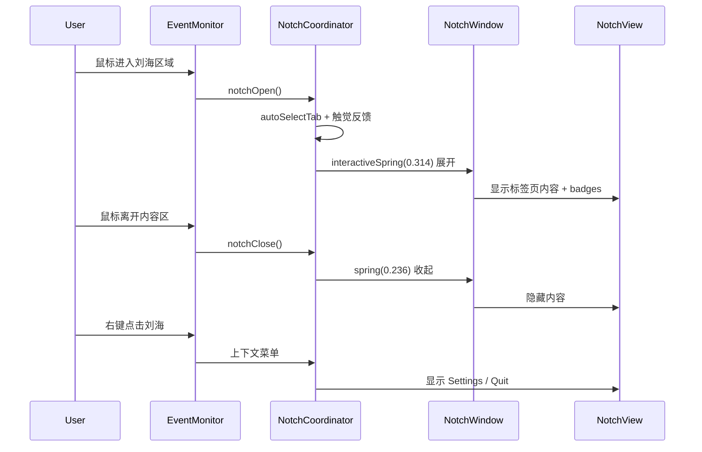

# NemoNotch — CLAUDE.md

## 项目概述

NemoNotch 是一个 macOS 刘海工具，在 MacBook 刘海区域提供可交互的浮动面板，集成媒体控制、日历事件、AI CLI 监控（Claude Code / Gemini CLI）、OpenClaw 多代理监控和应用启动器。

### 技术栈

- Swift 6 + SwiftUI，仅 macOS，依赖 CocoaLumberjack
- 关键框架：AppKit（NSWindow）、MediaPlayer、EventKit、IOKit

### 项目结构

```
NemoNotch/
├── NemoNotchApp.swift           # 入口，MenuBarExtra，全局快捷键，服务装配
├── Models/                      # 数据模型（Tab, AppSettings, AIProvider, PlaybackState 等）
├── Notch/                       # 刘海 UI 核心（窗口、动画、事件监听、TabBar、HUD）
├── Tabs/                        # 各标签页内容视图（AIChatTab 统一 AI 会话）
├── Services/                    # 后台服务（媒体、日历、AI CLI、启动器等）
├── Settings/                    # 设置界面
└── Helpers/                     # 工具类（MarkdownRenderer, ClaudeCrabIcon, ToolStyles）
```

## 架构

### 总览


```mermaid
graph TB
    subgraph Entry["App 入口"]
        App["NemoNotchApp<br/>@main"]
        AD["AppDelegate<br/>生命周期 & 服务装配"]
    end

    subgraph Services["Service 层 — 全部 @Observable"]
        MS["MediaService<br/>MediaRemote + NowPlayingCLI"]
        AIM["AICLIMonitorService<br/>统一 AI 入口"]
        CCS["ClaudeCodeService<br/>AIProvider 实现<br/>HookServer + ConversationParser"]
        GP["GeminiProvider<br/>AIProvider 实现<br/>GeminiConversationParser"]
        OCS["OpenClawService<br/>WebSocket 客户端"]
        CS["CalendarService<br/>EventKit"]
        LS["LauncherService<br/>应用搜索 & 启动"]
        NS["NotificationService<br/>Dock Accessibility API"]
        WS["WeatherService<br/>wttr.in"]
        HUD["HUDService<br/>音量/亮度/电池"]
        HK["HotkeyService<br/>Carbon 全局快捷键"]
    end

    subgraph NotchUI["Notch UI 层"]
        NC["NotchCoordinator<br/>开关状态 & 动画"]
        NW["NotchWindow<br/>NSPanel .statusBar+8"]
        NV["NotchView<br/>SwiftUI 主视图"]
        EM["EventMonitor<br/>鼠标事件监听"]
        CB["CompactBadge<br/>收起时的图标"]
        TB["TabBarView<br/>标签栏导航"]
        HO["HUDOverlayView<br/>音量/亮度叠加层"]
    end

    subgraph Tabs["标签页"]
        MT["MediaTab"]
        AT["AIChatTab<br/>Claude + Gemini 统一"]
        CLT["CalendarTab"]
        LT["LauncherTab"]
        OCT["OpenClawTab"]
        WT["WeatherTab"]
        ST["SystemTab"]
    end

    subgraph Settings["设置"]
        AS["AppSettings<br/>UserDefaults 持久化"]
        SW["SettingsWindow"]
        SV["SettingsView"]
    end

    App --> AD
    AD -->|"创建 & 持有"| Services
    AD -->|"创建"| NC
    AIM --> CCS
    AIM --> GP
    NC --> NW --> NV
    NV --> Tabs
    NV --> CB
    NV --> TB
    NV --> HO
    EM -->|"鼠标事件"| NC
    HK -->|"快捷键"| NC
    AS --> SV

    Services -.->|"@Environment 注入"| NV
    AS -.->|"@Environment 注入"| NV
```

核心数据流：Service → @Observable 属性变化 → SwiftUI 自动重绘 → Tab 内容更新。

### AI 服务架构


```mermaid
graph LR
    subgraph External["外部进程"]
        CC["Claude Code CLI"]
        GC["Gemini CLI"]
    end

    subgraph Monitor["AICLIMonitorService"]
        HS["HookServer<br/>/tmp/nemonotch.sock"]
        CP["ConversationParser<br/>Claude JSONL"]
        GCP["GeminiConversationParser<br/>Gemini JSON"]
    end

    subgraph Providers["AIProvider 实现"]
        CLS["ClaudeCodeService"]
        GPR["GeminiProvider"]
    end

    subgraph Data["数据模型"]
        AIS["AISessionState<br/>统一会话状态"]
        MSG["[ChatMessage]"]
        SA["SubagentState"]
    end

    subgraph Files["文件系统"]
        S["~/.claude/settings.json"]
        CJ["~/.claude/projects/**/*.jsonl"]
        GJ["~/.gemini/tmp/*/chats/"]
    end

    CC -->|"hook 事件"| HS
    GC -->|"hook 事件"| HS
    HS --> CLS
    HS --> GPR
    CP -->|"增量解析"| CJ
    GCP -->|"增量解析"| GJ
    CLS --> AIS
    GPR --> AIS
    AIS --> MSG
    AIS --> SA
```

### Notch 事件流


```mermaid
sequenceDiagram
    participant User
    participant EM as EventMonitor
    participant NC as NotchCoordinator
    participant NW as NotchWindow
    participant NV as NotchView

    User->>EM: 鼠标进入刘海区域
    EM->>NC: notchOpen()
    NC->>NC: autoSelectTab + 触觉反馈
    NC->>NW: interactiveSpring(0.314) 展开
    NW->>NV: 显示标签页内容 + badges

    User->>EM: 鼠标离开内容区
    EM->>NC: notchClose()
    NC->>NW: spring(0.236) 收起
    NW->>NV: 隐藏内容

    User->>EM: 右键点击刘海
    EM->>NC: 上下文菜单
    NC->>NV: 显示 Settings / Quit
```

### Badge 优先级（刘海收起时）

```
notification > openclaw active > ai approval > ai working > media playing > calendar upcoming
```

## 调试陷阱

### Info.plist 配置

**项目设置了 `GENERATE_INFOPLIST_FILE = YES`**，源文件 `NemoNotch/Info.plist` 中的键**不会进构建产物**！所有 Info.plist 键必须在 `NemoNotch.xcodeproj/project.pbxproj` 中以 `INFOPLIST_KEY_*` 形式声明（Debug 和 Release 两份配置都要加）。

加新权限描述（如 `NSAppleEventsUsageDescription`、`NSMicrophoneUsageDescription` 等）的正确流程：

1. 编辑 `project.pbxproj`，找到所有 `INFOPLIST_KEY_NSCalendarsFullAccessUsageDescription = ...;` 这种行，在旁边加一行 `INFOPLIST_KEY_NSAppleEventsUsageDescription = "...";`
2. 验证：`/usr/libexec/PlistBuddy -c "Print :Key" $APP/Contents/Info.plist` 必须能输出
3. **缺失 `NSAppleEventsUsageDescription` 会让 macOS 直接拒绝弹"自动化授权"对话框**，且自动化设置面板没法手动添加 app —— 这条坑非常深，调试时优先检查构建产物的 Info.plist 是否真的有这条 key

### 媒体信息获取

**⚠️ 重要**：媒体的 Now Playing 信息（标题、艺人、专辑、封面、时长、进度、播放状态）**全部通过 `NowPlayingCLI` 获取**，不是通过 `MediaRemote.swift` 里的 `MRMediaRemoteGetNowPlayingInfo`！

- `NowPlayingCLI` 启动一个 perl daemon（`mediaremote-mini.pl` + 解压自 `MediaRemoteMini.bin.gz` 的 dylib），通过 stdin/stdout JSON 协议轮询读取信息
- `MediaService.updateNowPlaying()` → `nowPlayingCLI.fetchNowPlayingInfo()` → `applyInfo()`
- `MediaRemote.swift` 只用来**发送控制命令**（play/pause/next/prev/skip）和**注册系统通知**触发刷新
- 调试"信息丢失"问题时，应优先排查 NowPlayingCLI daemon 状态 / dylib 解压（`~/Library/Application Support/NemoNotch/MediaRemoteMini.dylib`）/ perl 脚本，而不是改 MediaRemote.swift

**媒体 seek（快进/回退 15s）**：

- Music / Spotify：必须走 AppleScript `set player position`（`MediaBridge.setPlayerPosition`），因为 Spotify 不响应 MediaRemote 的 `SkipBackward/Forward` 命令（系统返回 "never supported"）。需要用户在"系统设置 → 隐私 → 自动化"中授权
- 其他播放器（浏览器、Podcasts 等）：走 MediaRemote 的 `skip(interval:)` 命令

## 开发约定

### 日志规范

使用 CocoaLumberjack（`LogService`），同时输出到控制台和文件。日志文件目录：`~/.NemoNotch/logs/`，保留 7 天，每天轮转。

调用方式：`LogService.debug/info/warn/error("message", category: "xxx")`

**日志覆盖要求** — 实现功能时，每个关键节点必须添加日志，确保问题可追溯：

- **Service 初始化/销毁**：`init` / `deinit` 记录 `.info` 级别日志，标记生命周期
- **外部交互**：网络请求、IPC 通信、文件 I/O、子进程启动/退出等，记录 `.info`（成功）或 `.error`（失败）
- **状态变更**：关键属性赋值（播放状态切换、会话阶段变化、连接状态等），记录 `.debug`，包含变更前后的值
- **错误路径**：所有 `catch`、`nil` 回退、权限被拒、超时等异常分支，必须记录 `.warn` 或 `.error`，附带上下文信息
- **异步回调入口**：Timer、NotificationCenter、Delegate 回调的入口记录 `.debug`，确认回调确实触发

category 命名规则：按模块取名，如 `"MediaService"`、`"HookServer"`、`"NotchCoordinator"`，便于按模块过滤

### Git 工作流

**绝对禁止直接在 main 分支上提交代码。** 所有开发必须通过 Git Flow 流程进行，违反此规则会破坏发布分支的稳定性。

- **main**: 稳定发布分支，只接受来自 develop 的合并，绝不直接 commit
- **develop**: 日常开发分支，所有功能分支基于此创建
- **feature/xxx**: 功能分支，从 develop 拉出，完成后合并回 develop
- **hotfix/xxx**: 紧急修复分支，从 main 拉出，修复后合并回 main 和 develop

工作流程：

1. 新功能开发：`git checkout develop && git checkout -b feature/xxx`
2. 开发完成后合并回 develop，测试通过后合并 develop 到 main
3. 发版时从 main 打 tag（`vX.Y.Z`）

### 编码约定

- 设计文档放在 `docs/plans/` 目录，已实现的 plan 自动归档，提交时一并提交 plan 文档
- 每次新增功能或修改已有功能后，必须同步更新 `README.md` 和 `README_CN.md` 中对应的功能描述、技术栈等章节
- 所有 Service 使用 `@Observable` 宏，通过 SwiftUI 响应式更新 UI
- AI 提供商实现 `AIProvider` 协议，通过 `AICLIMonitorService` 统一管理
- 刘海窗口 level 固定为 `.statusBar + 8`，属性为 `fullScreenAuxiliary` + `stationary` + `canJoinAllSpaces`
- 优先查阅参考项目中的现成实现，避免从零造轮子

### 协议优先的可扩展设计

多提供商场景（AI Provider、Conversation Parser 等）采用**协议 + 具体实现**模式：

- 定义协议只包含**通用接口**（如 `messages`、`tokens`、`findSessionFile`）
- 每个 Provider/Parser 保留**独立的 Result 类型和解析逻辑**，不强行统一数据结构
- Provider 特有字段（Claude 的 `cacheRead`、Gemini 的 `thoughtTokens`）留在各自实现中，通过协议扩展或具体类型访问
- 通用消费方走协议接口，特定逻辑直接访问具体类型
- 新增 Provider（如 DeepSeek、OpenAI）只需实现协议，不改动已有代码

## 参考项目

所有参考项目位于 `/Users/gaozimeng/Learn/macOS/`，遇到实现问题时优先查看这些项目的做法。

| 需求 | 参考项目 | 借鉴内容 |
|------|---------|----------|
| 刘海窗口定位、多屏幕 | **NotchDrop** | NSPanel 子类，screen.notchSize 检测，每屏独立 WindowController |
| 刘海窗口管理、三态状态机 | **Peninsula** | NSPanel 子类窗口管理、刘海定位、closed/popping/opened 状态机、NotchBackgroundView 刘海形状渲染 |
| 刘海动画、自动收起 | **DynamicNotchKit** | Spring 动画 .bouncy(duration: 0.4)、Timer 自动消失、NSScreen 扩展（hasNotch/notchSize/notchFrame） |
| 鼠标事件监听 | **NotchDrop** | 全局 NSEvent monitor 鼠标接近/离开检测 |
| 全局快捷键 | **Peninsula** | Carbon RegisterEventHotKey 全局快捷键注册 |
| Now Playing 信息获取 | **PlayStatus** / **Tuneful** | MediaPlayer 框架，MPNowPlayingInfoCenter 轮询 |
| 媒体键拦截 | **PlayStatus** | sendEvent override 拦截 NX_KEYTYPE_PLAY 等系统按键 |
| 命令行播放信息 | **nowplaying-cli** | daemon 连接 → legacy callback → MRNowPlayingController 三级回退，dylib 路径搜索 |
| MediaRemote 桥接 | **PlayStatus** | dlopen/dlsym 动态加载 MediaRemote.framework 私有 API |
| 窗口管理 | **Loop** | WindowEngine 架构，径向菜单，键盘事件处理 |
| Spotlight 搜索栏 | **DSFQuickActionBar** | NSPanel 浮窗，异步搜索，键盘导航 |
| Dock 悬停预览 | **DockDoor** | SCWindow 截图，窗口缩略图缓存，AXUIElement 控制窗口 |
| 菜单栏架构 | **eul** | StatusBarManager，Combine 响应式，深色/浅色模式适配，host_processor_info CPU 采样、host_statistics64 内存读取 |
| 亮度监测 | **MonitorControl** | DisplayServicesGetBrightness() 私有 API，dlopen 动态加载 |
| AI Hook 架构 | **masko-code** | Unix Socket 事件传递、HookInstaller 写入 ~/.claude/settings.json、hook-sender.sh 进程树检测 |
| 会话解析 | **vibe-notch** | 增量 JSONL 解析、ChatMessage 结构化解析、PermissionRequest 审批流程 |
| 状态图标 | **NotchNook** | 刘海两侧图标布局风格 |

## 打包发布

- 一键打包命令：`./build.sh`，自动完成 Archive → 导出 .app → 生成 DMG
- 输出文件：`build/NemoNotch.dmg`
- 配套文件：`ExportOptions.plist`（导出配置）、`build.sh`（打包脚本）
- 当前跳过签名（`CODE_SIGN_IDENTITY="-"`），如需正式分发需配置签名和公证

### 发版流程

用户说"发版"时，执行以下步骤：

1. 确认所有更改已提交到 main 分支
2. 创建版本 tag（格式 `vX.Y.Z`，如 `v0.1.0`）
3. 推送 tag 到 origin：`git push origin <tag>`
4. GitHub Actions 自动构建并发布 DMG 到 Releases（workflow 文件：`.github/workflows/release.yml`）
5. 查看构建状态：`https://github.com/GaoZimeng0425/NemoNotch/actions`
