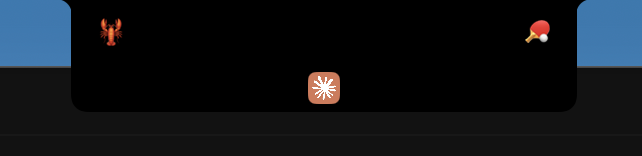

# NemoNotch

An interactive floating panel for the MacBook notch area, turning the notch into a multi-purpose information hub.

<p align="center">
  
</p>

<p align="center">
  <a href="README_CN.md">中文文档</a>
</p>

## Features

### 7 Functional Tabs

| Tab | Description |
|-----|-------------|
| **Media** | Real-time playback controls (play/pause/next/previous), album artwork, progress bar. Supports Spotify & Apple Music |
| **Calendar** | 15-day date picker, daily event list, color-coded calendars, permission guidance |
| **Claude Code** | Session list, conversation details, permission approval, context usage bar, subagent monitoring, model display |
| **OpenClaw** | Multi-agent status monitoring, WebSocket real-time connection, agent state tracking |
| **Launcher** | App icon grid, search filter, quick-launch custom app list |
| **Weather** | Current temperature / feels-like, high/low, humidity & wind, 3-hour hourly forecast |
| **System** | CPU / memory / battery / disk monitoring, sparkline history, color-coded thresholds |

### Highlights

- **Notch Floating Panel** — Hovers over the notch area, auto-detects notch size
- **Global Shortcuts** — `⌥⌘N` toggle panel, `⌥⌘1-7` switch tabs
- **Smart Auto-Switch** — Automatically selects the active tab (Claude working, music playing, etc.)
- **Menu Bar Entry** — Control panel visibility and Claude Code Hooks installation from the menu bar
- **Claude Code Integration** — Hook event listening, session tracking, permission interception, terminal detection, interrupt awareness

## Tech Stack

- **Swift 5** + **SwiftUI**, native macOS app
- **AppKit** — Custom NSWindow, click-through, multi-screen positioning
- **MediaPlayer / MediaRemote** — Media playback control
- **EventKit** — Calendar event access
- **IOKit** — System monitoring (CPU, memory, battery, disk)
- **CocoaLumberjack** — Logging (`~/.NemoNotch/logs/`, 7-day rotation)
- **WebSocket / Unix Socket** — Claude Code Hooks & OpenClaw communication

## Project Structure

```
NemoNotch/
├── NemoNotchApp.swift           # Entry point, MenuBarExtra, global hotkeys
├── Models/                      # Data models (Tab, AppSettings, PlaybackState, etc.)
├── Notch/                       # Notch UI core (window, animation, event handling)
├── Tabs/                        # Tab content views
├── Services/                    # Background services (media, calendar, Claude Code, etc.)
├── Settings/                    # Preferences UI
└── Helpers/                     # Utilities
```

## Build

1. Open `NemoNotch.xcodeproj` in Xcode
2. Select the `NemoNotch` target
3. Build & Run (requires macOS 14+)

## Acknowledgements

NemoNotch draws inspiration from the following open-source projects:

### Notch Window & Interaction

- [**NotchDrop**](https://github.com/Lakr233/NotchDrop) — Notch window positioning, multi-screen support, click-through
- [**DynamicNotchKit**](https://github.com/Lakr233/DynamicNotchKit) — Spring animations, auto-dismiss, content switching
- [**Peninsula**](https://github.com/yufan8414/Peninsula) — Multi-view state management in the notch area

### Media & Playback

- [**PlayStatus**](https://github.com/nicklama/PlayStatus) — MediaRemote framework integration, media key interception
- [**Tuneful**](https://github.com/Dimillian/Tuneful) — Now playing info & UI
- [**nowplaying-cli**](https://github.com/kirtan-shah/nowplaying-cli) — CLI tool for now playing info

### Window Management & Shortcuts

- [**Loop**](https://github.com/MrKai77/Loop) — Global hotkey registration, window operations
- [**DSFQuickActionBar**](https://github.com/dagronf/DSFQuickActionBar) — Floating search bar component

### Display & System Monitoring

- [**MonitorControl**](https://github.com/MonitorControl/MonitorControl) — Display brightness reading via DisplayServices API

### Menu Bar & System Tools

- [**eul**](https://github.com/gao-sun/eul) — Menu bar architecture, Combine reactive patterns
- [**menubar_runcat**](https://github.com/Kyle-Ye/menubar_runcat) — Menu bar status animation

### Launcher & UI Components

- [**sol**](https://github.com/ospfranco/sol) — App launcher architecture
- [**Luminare**](https://github.com/Dimillian/Luminare) — SwiftUI component library & design language

### AI & Desktop Integration

- [**Vibe Notch**](https://github.com/farouqaldori/vibe-notch) — Claude Code notch notifications, session monitoring, permission approval UI
- [**masko-code**](https://github.com/nicepkg/masko-code) — Claude Code status monitoring & desktop overlay concept

## License

MIT
