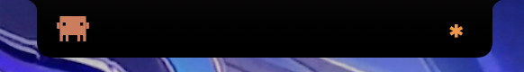
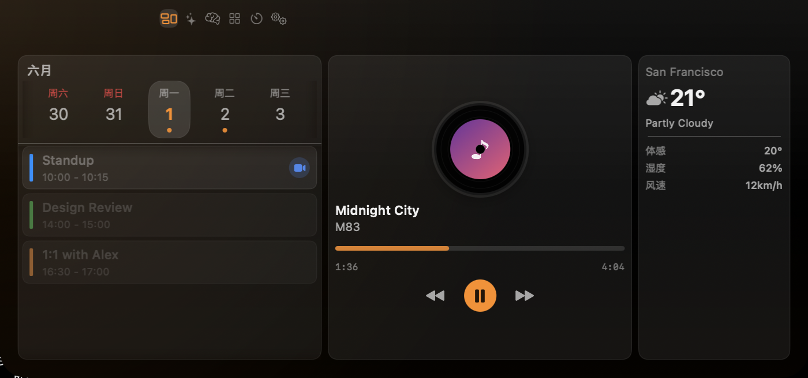
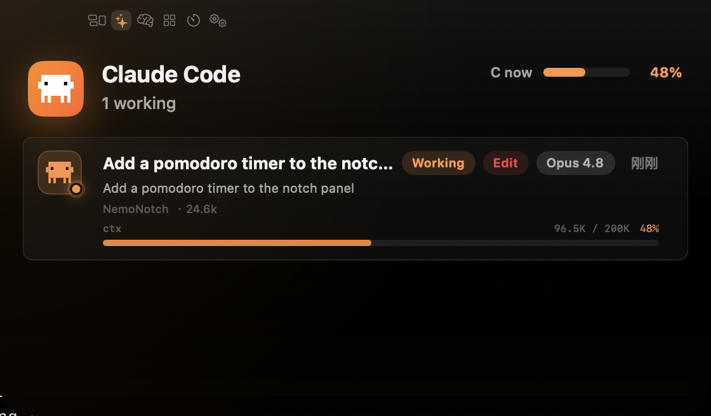
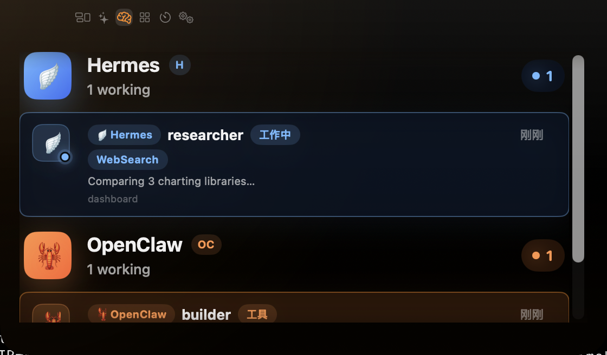
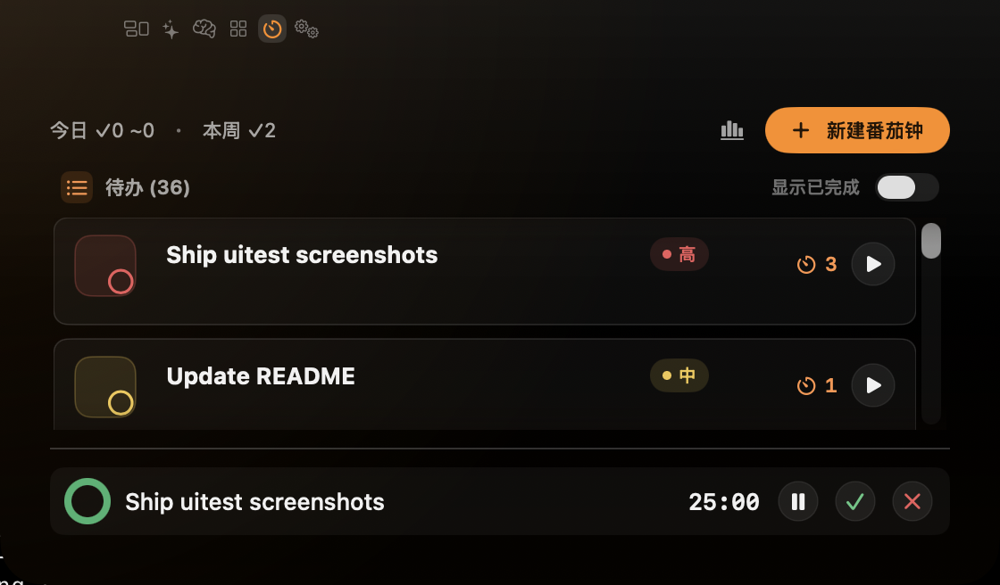
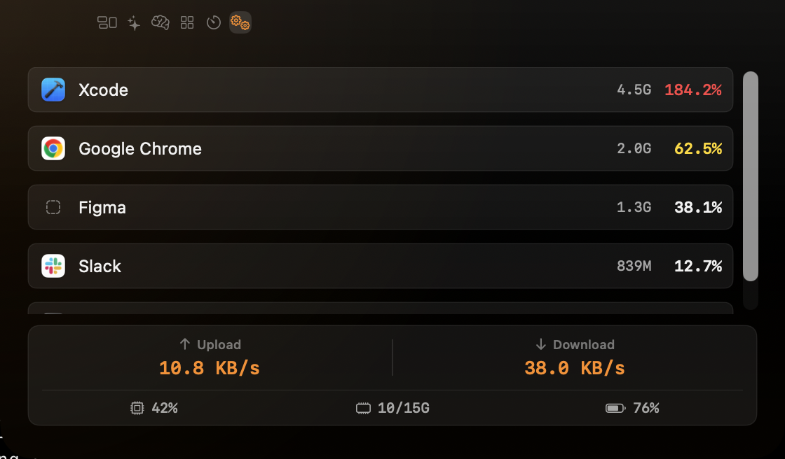
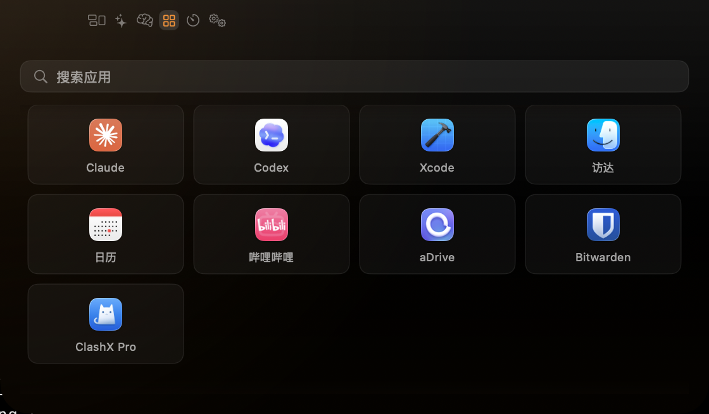
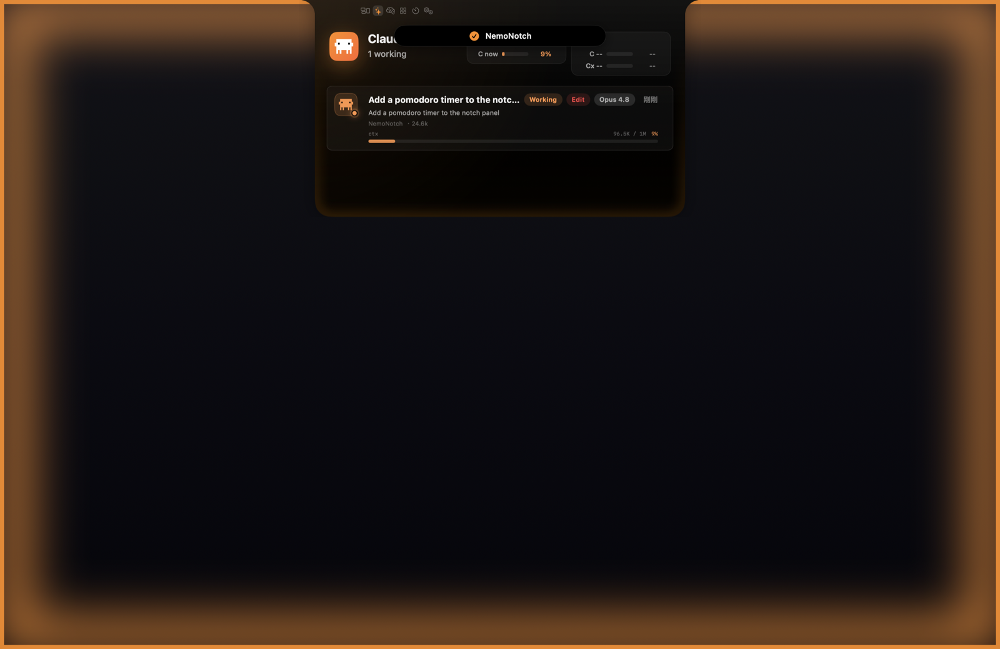

# NemoNotch

An interactive floating panel for the MacBook notch area, turning the notch into a multi-purpose information hub.

<p align="center">
  
</p>

<p align="center"><em>Real-time AI session &amp; agent status.</em></p>

<p align="center">
  
</p>

<p align="center">
  
  
</p>

<p align="center">
  
  
</p>

<p align="center">
  
</p>

<p align="center">
  <a href="README_CN.md">中文文档</a>
</p>

## Features

### 6 Functional Tabs

| Tab | Description |
|-----|-------------|
| **Overview** | Three glanceable panels in one tab — **Media**: real-time playback controls (play/pause/next/previous/seek), album artwork, progress bar — works with any player that reports Now Playing (Apple Music, Spotify, browsers, Podcasts, NetEase Music, …) via a Perl bridge to the system media controls; **Calendar**: 15-day date picker, daily event list, color-coded calendars, clickable meeting URLs; **Weather**: current temperature / feels-like, high/low, humidity & wind, 3-hour hourly forecast |
| **AI Chat** | Unified Claude Code & Gemini CLI monitoring — session list, conversation details, permission approval, context usage bar, subagent tracking, model display |
| **Agents** | Multi-agent status monitoring for OpenClaw (WebSocket) and Hermes-agent (HTTP API), real-time agent state tracking |
| **Launcher** | App icon grid, search filter, quick-launch custom app list |
| **Pomodoro** | Classic 25/5/15 cycle with persistent TODO list, per-task completed-pomodoro counts, hotkey-summoned centered QuickStart panel, end-of-phase sound + system notification, collapsed-notch 🍅 + remaining-time pie |
| **System** | Top 5 process resource ranking (CPU & memory), app icons, system summary footer (CPU / RAM / battery / network) |

### Highlights

- **Notch Floating Panel** — Hovers over the notch area, auto-detects notch size
- **Multi-AI Provider** — Unified interface for Claude Code and Gemini CLI with hook event listening, session tracking, and permission interception
- **AI usage quota** — shows your Claude Code, Codex, and Gemini usage quotas (utilization % + reset countdown) as a card in the AI tab, read from each CLI's OAuth credential. The Codex and Gemini sections appear automatically when those CLIs are signed in.
- **Global Shortcuts** — Toggle panel: configure your own in Settings → Hotkeys (no default). Tab switches default to `⌥⌘1-5`. All bindings are user-customizable, powered by [KeyboardShortcuts](https://github.com/sindresorhus/KeyboardShortcuts)
- **Smart Auto-Switch** — Automatically selects the active tab (AI working, music playing, etc.)
- **Activity Glow** — When AI/agents are busy (working, or waiting for approval), the expanded notch shows a soft blurred glow in the app's theme orange along its lower inner edge, fading out by the middle (content stays clean)
- **Completion Flash** — When an AI session or agent finishes a turn (working→idle), NemoNotch plays a one-shot full-screen accent-orange edge glow on all screens, plus a HUD-style toast capsule near the notch showing the finished project/agent name(s). Rapid completions are throttled and merged into the visible toast rather than replaying the flash. Toggleable in Settings.

  <p align="center">
    
  </p>
- **Menu Bar Entry** — Fixed pixel-art notch icon (state is visible on the notch panel above the menubar); menu shows Now Playing controls (previous / play-pause / next) when media is active
- **HUD Overlay** — Volume, brightness, and battery level indicators with segmented bars
- **i18n** — Supports English and Simplified Chinese, switchable in Settings
- **Explicit permission requests.** NemoNotch does not auto-request permissions on launch. Each feature surfaces a "Grant Access" button (Calendar in the Overview tab, Location in the Weather card, Automation in the Media card when controlling Music/Spotify) — click to invoke the system dialog.
- **ESC closes the notch.** Press ESC any time the notch is opened.

## Tech Stack

- **Swift 6** + **SwiftUI**, native macOS app
- **AppKit** — Custom NSWindow, click-through, multi-screen positioning
- **MediaPlayer / MediaRemote** — Media playback control
- **EventKit** — Calendar event access
- **IOKit** — System monitoring (CPU, memory, battery, disk)
- **libproc** — Per-process resource tracking via kernel APIs
- **CocoaLumberjack** — Logging (`~/.NemoNotch/logs/`, 7-day rotation)
- **KeyboardShortcuts** — User-customizable global hotkeys (replaces Carbon `RegisterEventHotKey`)
- **WebSocket / Unix Socket** — AI CLI Hooks & OpenClaw communication
- **HTTP API** — Hermes-agent monitoring via localhost:8787

## Project Structure

```
NemoNotch/
├── NemoNotchApp.swift           # Entry point, MenuBarExtra, global hotkeys
├── Models/                      # Data models (Tab, AppSettings, AIProvider, PlaybackState, etc.)
├── Notch/                       # Notch UI core (window, animation, event handling, TabBar, HUD)
├── Tabs/                        # Tab content views (AIChatTab for unified AI sessions)
├── Services/                    # Background services (media, calendar, AI CLI monitor, launcher, etc.)
├── Settings/                    # Preferences UI
└── Helpers/                     # Utilities (MarkdownRenderer, ClaudeCrabIcon, ToolStyles)
```

## Build

1. Open `NemoNotch.xcodeproj` in Xcode
2. Select the `NemoNotch` target
3. Build & Run (requires macOS 14+)

> **Note:** If macOS blocks the app on first launch, run the following command to remove the quarantine attribute:
>
> ```bash
> sudo xattr -d com.apple.quarantine /Applications/NemoNotch.app
> ```

## Acknowledgements

NemoNotch draws inspiration from the following open-source projects:

### Notch Window & Interaction

- [**NotchDrop**](https://github.com/Lakr233/NotchDrop) — Notch window positioning, multi-screen support, click-through
- [**DynamicNotchKit**](https://github.com/MrKai77/DynamicNotchKit) — Spring animations, auto-dismiss, content switching
- [**Peninsula**](https://github.com/celve/Peninsula) — Multi-view state management in the notch area

### Media & Playback

- [**PlayStatus**](https://github.com/nbolar/PlayStatus) — MediaRemote framework integration, media key interception
- [**Tuneful**](https://github.com/martinfekete10/Tuneful) — Now playing info & UI
- [**nowplaying-cli**](https://github.com/kirtan-shah/nowplaying-cli) — CLI tool for now playing info
- [**mediaremote-adapter**](https://github.com/ejbills/mediaremote-adapter) — Perl bridge for media control on macOS 15.4+ (bypasses the private-API signature gate)

### Window Management & Shortcuts

- [**Loop**](https://github.com/MrKai77/Loop) — Global hotkey registration, window operations
- [**DSFQuickActionBar**](https://github.com/dagronf/DSFQuickActionBar) — Floating search bar component

### Display & System Monitoring

- [**MonitorControl**](https://github.com/MonitorControl/MonitorControl) — Display brightness reading via DisplayServices API

### Menu Bar & System Tools

- [**eul**](https://github.com/gao-sun/eul) — Menu bar architecture, Combine reactive patterns
- [**menubar_runcat**](https://github.com/Kyome22/menubar_runcat) — Menu bar status animation

### Launcher & UI Components

- [**sol**](https://github.com/ospfranco/sol) — App launcher architecture
- [**Luminare**](https://github.com/MrKai77/Luminare) — SwiftUI component library & design language

### AI & Desktop Integration

- [**Vibe Notch**](https://github.com/farouqaldori/vibe-notch) — Claude Code notch notifications, session monitoring, permission approval UI
- [**masko-code**](https://github.com/RousselPaul/masko-code) — Claude Code status monitoring & desktop overlay concept

### UI & Design

- [**Notch Pilot**](https://notchpilot.app/) — Visual reference for the notch panel's layout, tab structure, and console-style header treatment

## License

MIT
